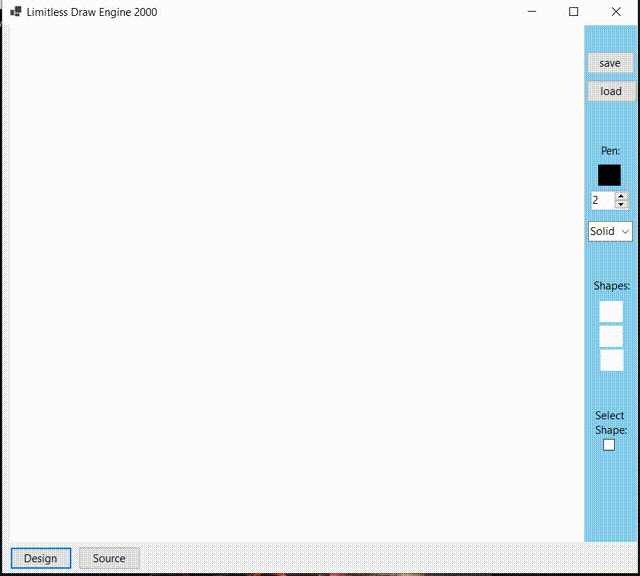
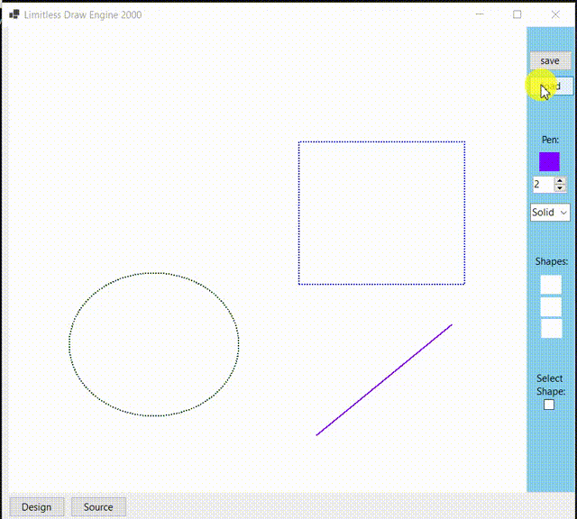
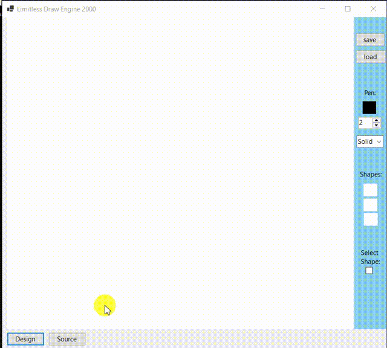
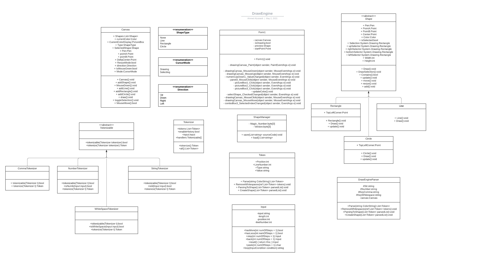

# Drawing Engine

## وصف:

**محرك رسم** هو برنامج يسمح للمستخدم برسم أشكال (مربع, دائرة, خط) مع مميزات اضافية منها تغيير اللون والشكل والحجم.  
 

|     Technologies Used              |      
|------------------------------------|
|  Windows Forms App                 |
| GDI+                               |
|  C# 9                              |
|  .Net 5                            |

 

## الأستخدام: 
يقوم المستخدم بإختيار الشكل أولاً, من ثم اختيار اللون والحجم والنوع. وبداية الرسم على اللوحة البيضاء. أو بإمكانك الكتابة على صفحة المصدر للرسم وسيظهر الشكل المطلوب في لوحة الرسم.
 
  
 
# DEMO

### 1. Drawing, Moving and resizing:

 

### 2. Source code and Save:

 

### 3. Loading:

 

## UML diagram

## الفريق: 

- سلطان الزعبي
- احمد الزبيدي
- رياض الغامدي
- محمد راشد

 

### أشراف: أ.عبدالله عيد

 
